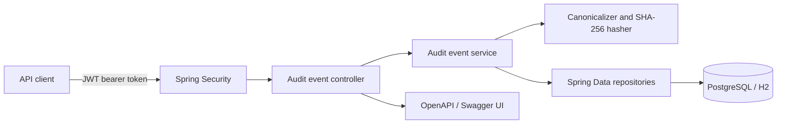
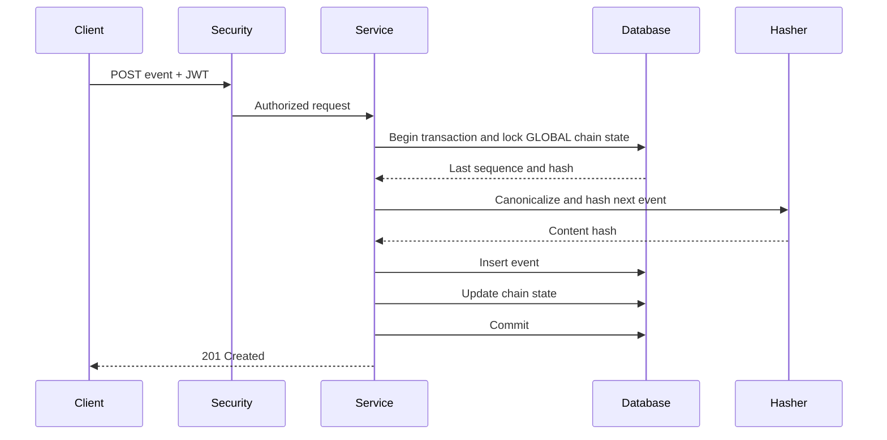

# Architecture and Design

## 1. System overview

The solution is a stateless Spring Boot REST service backed by a relational database. It stores audit events in one append-only global hash chain. Each event contains its own SHA-256 hash and the hash of the previous event, making historical modification detectable.



The service owns validation, authorization, canonical hashing, chain construction, query composition, and verification. The database owns durable storage, uniqueness, transaction isolation, and chain-head locking.

## 2. Storage decision

### Production: PostgreSQL

PostgreSQL is the production system of record because the problem requires strong transactional consistency and predictable ordered writes. A relational database provides:

- ACID transactions for atomically writing an event and advancing the chain head.
- Row-level locking to serialize updates to the global chain head.
- Unique constraints for sequence numbers.
- Efficient indexed queries across actor, resource, event type, and time.
- Mature backup, recovery, monitoring, and access-control capabilities.
- JSON support if payload-specific querying is added later.

### Local development: H2

H2 is used for quick local startup and automated tests. It runs in PostgreSQL compatibility mode, but it is not considered proof of production behavior. PostgreSQL locking, SQL types, indexing, and migration behavior must be validated in the target deployment environment.

### Rejected alternatives

| Option | Decision | Reason |
| --- | --- | --- |
| In-memory collection | Rejected | Data disappears on restart and cannot demonstrate durable tamper detection. |
| NoSQL document database | Rejected for prototype | Flexible payload storage is useful, but ordered transactional chain-head updates and multi-field queries are simpler in SQL. |
| File-only append log | Rejected | Simple appends are possible, but filtering, pagination, concurrency, recovery, and operational management become harder. |
| Event streaming platform | Deferred | Kafka-style systems help at high scale but add infrastructure beyond the assignment's working prototype. |

## 3. Component design

### Controller layer

- Defines REST endpoints and HTTP status codes.
- Validates request DTOs.
- Passes authenticated requests to services.
- Does not calculate hashes or access repositories directly.

### DTO layer

- Separates the public API contract from JPA entities.
- Defines write, query, verification, and error schemas.
- Prevents persistence implementation details from leaking through the API.

### Service layer

- Coordinates append transactions.
- Applies query filters and pagination.
- Walks and verifies the chain.
- Enforces application invariants.
- Maps entities to response DTOs.

### Hashing component

- Produces a deterministic canonical byte representation.
- Calculates SHA-256 hashes.
- Is shared by write and verification flows.
- Selects behavior using `hashVersion` so the format can evolve.

### Repository layer

- Persists audit events and chain state.
- Supplies filter specifications and ordered/paged reads.
- Locks the chain-state row during writes.
- Contains no HTTP or security logic.

### Security layer

- Validates JWT signature, issuer, audience, and expiry.
- Converts token roles/scopes to Spring authorities.
- Separates writer, reader, and administrator permissions.
- Leaves production token issuance to an external identity provider.

### Database

- Stores immutable event rows and one chain-head row.
- Enforces sequence uniqueness and required fields.
- Uses a restricted application database account with no event `UPDATE` or `DELETE` permission in production.

## 4. Data model

### `audit_events`

| Column | Type | Constraints | Description |
| --- | --- | --- | --- |
| `id` | `bigint` | Primary key | Internal identifier. |
| `sequence_number` | `bigint` | Unique, not null | Global chain position. |
| `event_type` | `varchar(100)` | Not null | Event classification. |
| `actor_id` | `varchar(100)` | Not null | User or service responsible. |
| `resource_type` | `varchar(100)` | Not null | Affected resource type. |
| `resource_id` | `varchar(150)` | Not null | Affected resource identifier. |
| `payload` | `text` initially | Not null | Canonical JSON event details. |
| `occurred_at` | timestamp with time zone | Nullable | Caller-declared occurrence time. |
| `recorded_at` | timestamp with time zone | Not null | Server-controlled ingestion time. |
| `previous_hash` | `char(64)` | Not null | Previous content hash or genesis hash. |
| `content_hash` | `char(64)` | Not null | Current SHA-256 content hash. |
| `hash_version` | integer | Not null | Canonicalization and hash format version. |

Indexes:

- Unique: `sequence_number`.
- Single-column: `actor_id`, `event_type`, `recorded_at`.
- Composite: `resource_type, resource_id`.

### `chain_state`

| Column | Type | Constraints | Description |
| --- | --- | --- | --- |
| `chain_name` | `varchar(50)` | Primary key | `GLOBAL` for the prototype. |
| `last_sequence` | `bigint` | Not null | Latest committed sequence. |
| `last_hash` | `char(64)` | Not null | Latest committed event hash. |

The `GLOBAL` row is created by a database migration with sequence `0` and the genesis hash.

## 5. Hash-chain design

### Algorithm

Use SHA-256 through Java's standard `MessageDigest` API.

Reasons:

- Widely supported and understood.
- Deterministic across platforms.
- Strong collision and preimage resistance for this use case.
- Produces a compact 32-byte digest represented by 64 hexadecimal characters.
- Avoids an additional cryptographic library.

SHA-256 provides tamper evidence, not authenticity. A user with permission to rewrite the full database could recompute the entire chain. Production-strength external proof therefore requires signed checkpoints or storage outside the database trust boundary.

### Version 1 canonical input

The exact byte format must be specified and covered by known-value tests. Version 1 includes:

```text
hashVersion
sequenceNumber
eventType
actorId
resourceType
resourceId
canonicalPayload
occurredAt
recordedAt
previousHash
```

Rules:

- UTF-8 encoding.
- Fixed field order.
- Length-prefixed values instead of an ambiguous delimiter.
- Explicit marker for null `occurredAt`.
- UTC ISO-8601 timestamps.
- Recursively sorted JSON object keys.
- Preserved JSON array order.
- Stable number and Boolean representation.
- Genesis previous hash: 64 lowercase zero characters.
- Lowercase hexadecimal output.

The current starter code uses a simple delimiter-based representation. It must be replaced by the specified length-prefixed canonicalizer before the hash format is considered complete.

## 6. Data flows

### Append event



If any insert or chain-state update fails, the transaction rolls back. The chain head must never advance without its corresponding event.

### Query events

1. Validate JWT and reader authority.
2. Validate the optional time range and pagination bounds.
3. Compose database predicates only for supplied filters.
4. Execute an indexed query ordered by ascending sequence.
5. Map the page of entities to response DTOs.

Querying does not recalculate the entire chain. Integrity is checked through the verification endpoint.

### Verify chain

1. Read records in ascending sequence using bounded pages or streaming.
2. Expect the genesis hash and sequence `1` for the first event.
3. For each event, verify sequence continuity.
4. Compare `previousHash` with the preceding verified content hash.
5. Recreate canonical bytes and recompute the content hash.
6. Stop at the first mismatch and return its sequence and violation type.
7. Return an intact result only after all records are checked.

Verification is read-only and never repairs data.

## 7. API design

All API paths use `/api/v1`. JSON timestamps use UTC ISO-8601. Protected endpoints accept `Authorization: Bearer <JWT>`.

### Append an event

`POST /api/v1/audit-events`

Request:

```json
{
  "eventType": "USER_LOGIN",
  "actorId": "user-123",
  "resourceType": "ACCOUNT",
  "resourceId": "account-456",
  "payload": {
    "outcome": "SUCCESS",
    "channel": "WEB"
  },
  "occurredAt": "2026-08-18T10:00:00Z"
}
```

Response: HTTP `201 Created`

```json
{
  "id": 1,
  "sequenceNumber": 1,
  "eventType": "USER_LOGIN",
  "actorId": "user-123",
  "resourceType": "ACCOUNT",
  "resourceId": "account-456",
  "payload": {
    "outcome": "SUCCESS",
    "channel": "WEB"
  },
  "occurredAt": "2026-08-18T10:00:00Z",
  "recordedAt": "2026-08-18T10:00:01Z",
  "previousHash": "0000000000000000000000000000000000000000000000000000000000000000",
  "contentHash": "64-character-lowercase-sha256-value",
  "hashVersion": 1
}
```

### Query events

`GET /api/v1/audit-events`

Supported parameters: `actorId`, `resourceType`, `resourceId`, `eventType`, `from`, `to`, `page`, and `size`.

Example:

```text
GET /api/v1/audit-events?resourceType=ACCOUNT&resourceId=account-456&page=0&size=20
```

Response: HTTP `200 OK` with a Spring-style page containing `content`, page number, page size, total elements, and total pages.

### Verify chain

`GET /api/v1/audit-events/verify`

Response: HTTP `200 OK`

```json
{
  "intact": false,
  "recordsChecked": 7,
  "firstBrokenSequence": 7,
  "violationType": "CONTENT_HASH_MISMATCH"
}
```

Violation types:

- `GENESIS_HASH_MISMATCH`
- `SEQUENCE_GAP`
- `PREVIOUS_HASH_MISMATCH`
- `CONTENT_HASH_MISMATCH`

### Error schema

Use RFC 9457 problem details:

```json
{
  "type": "https://example.invalid/problems/validation-error",
  "title": "Request validation failed",
  "status": 400,
  "detail": "One or more request fields are invalid",
  "instance": "/api/v1/audit-events",
  "errors": {
    "eventType": "must not be blank"
  }
}
```

Do not include payload values, credentials, JWT contents, stack traces, or internal SQL in errors.

## 8. Security design

| Endpoint | Required authority |
| --- | --- |
| `POST /api/v1/audit-events` | `AUDIT_WRITER` |
| `GET /api/v1/audit-events` | `AUDIT_READER` or `AUDIT_ADMIN` |
| `GET /api/v1/audit-events/verify` | `AUDIT_READER` or `AUDIT_ADMIN` |
| `/actuator/health` | Public, minimal details only |
| Swagger/OpenAPI | Public locally; disabled or protected in production |

Production requirements:

- Validate JWT signature, issuer, audience, expiry, and not-before time.
- Rotate identity-provider keys through JWKS.
- Use TLS for all traffic.
- Use a least-privilege database account.
- Keep JWTs, keys, secrets, and sensitive payload data out of logs.
- Audit administrative verification, export, archive, and redaction actions.

## 9. Trade-offs

### One global chain

Benefit: Simple verification and a single total event order.

Cost: Every write contends on one chain-head row. Throughput is intentionally traded for correctness and simplicity. A future design can partition chains by tenant while retaining a signed global checkpoint.

### Synchronous hashing and persistence

Benefit: The caller receives confirmation only after the event is durably linked.

Cost: Write latency includes locking, hashing, and database commit. Asynchronous ingestion could increase throughput but makes acknowledgement semantics and failure handling more complex.

### H2 locally, PostgreSQL in production

Benefit: Easy local setup.

Cost: H2 does not reproduce every PostgreSQL behavior. Production deployment requires a separate PostgreSQL validation pass.

### Payload stored as canonical text

Benefit: The exact hashed representation is retained and database portability remains simple.

Cost: Payload-field queries are limited. PostgreSQL `jsonb` could improve payload queries, but its normalized storage must not become the hashing representation.

### JWT resource server only

Benefit: Authentication responsibility remains separated from the audit service.

Cost: Local protected API testing requires a test issuer or signed test tokens. Building a login/password system into this service is intentionally avoided.

## 10. Risks and mitigations

| Risk | Impact | Mitigation |
| --- | --- | --- |
| Non-deterministic JSON hashing | Valid records appear corrupted across versions. | Versioned canonicalizer and known-value tests. |
| Concurrent write fork | Two records reference the same predecessor. | Lock the database chain-state row and enforce unique sequences in one transaction. |
| Full database rewrite by privileged attacker | Attacker recalculates a valid-looking chain. | Least privilege, immutable external checkpoints, signed exports, and separated administrative control. |
| Verification memory/time growth | Large chains cause slow responses or excessive memory. | Stream/page records, add metrics, and later introduce verified checkpoints. |
| H2/PostgreSQL differences | Local success fails in production. | Run migrations and smoke/concurrency checks against the target PostgreSQL environment before deployment. |
| Sensitive data in payloads | Privacy or compliance breach. | Schema guidance, allowlisted payloads, no payload logging, and Scenario B structured redaction. |
| JWT misconfiguration | Unauthorized access or service outage. | Validate issuer/audience, test role mapping, rotate keys, and fail closed. |
| Missing database immutability controls | Application or operator changes history. | Remove update/delete API paths and revoke production application `UPDATE`/`DELETE` privileges. |
| Page-number pagination on changing data | Clients may observe shifting pages. | Stable sequence ordering now; introduce cursor pagination for high-volume production use. |
| SHA-256 format change | Old records become unverifiable. | Persist `hashVersion` and retain all historical verification implementations. |

## 11. Current scope boundary

This architecture covers the Scenario A foundation. Archive checkpoints, crypto-shredding redaction, self-contained signed exports, and compliance reporting will extend this design after the write/query/verify flow is implemented and tested. They must not change existing event hashes or silently redefine hash version 1.
