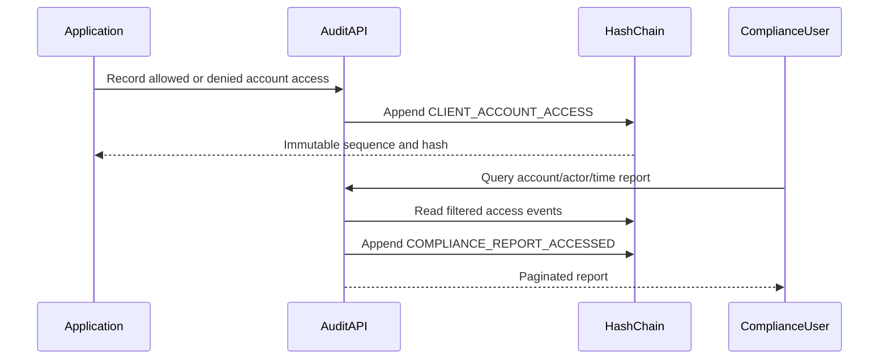

# Scenario C - Client Account Access Compliance

## 1. Original requirement

> Regulators need to be able to audit access to client account data.

This statement does not define what constitutes access, which systems are in scope, what evidence regulators expect, who may view it, how long it must be retained, or whether denied attempts must be included.

## 2. Clarified requirement statement

> The audit service shall record every application-mediated attempt to view, search, or download client account data, whether allowed or denied. Each record shall identify the account, actor, action, declared business purpose, access channel, outcome, correlation ID, occurrence time, and server recording time. The audit payload shall not contain the client data that was viewed. Authorized compliance users shall be able to retrieve these records by account, actor, and recorded time range with pagination. Every compliance-report access shall itself create an immutable audit event.

This is the concrete requirement used for the prototype implementation.

## 3. Ambiguities identified

- Meaning of "client account data": identifiers only, balances, transactions, documents, profile data, or every related field.
- Meaning of "access": successful reads only, denied attempts, searches, list screens, downloads, batch jobs, cache reads, database reads, or third-party access.
- System boundary: this service, all REST APIs, browser UI, mobile application, batch platform, direct SQL, data warehouse, and external vendors.
- Actor identity: employee, customer, service account, delegated identity, device, or combined identities.
- Regulatory authority and jurisdiction.
- Required report format and delivery mechanism.
- Retention and legal-hold periods.
- Whether business purpose is free text or a controlled classification.
- Whether reports must include authorization-policy decisions and reason codes.
- Whether regulators access reports directly or receive approved exports.
- Required timeliness, volume, query latency, and availability.
- Whether querying/exporting compliance evidence must itself be audited.
- Which identifiers are considered personal data and require masking or redaction.

## 4. Prototype assumptions

1. The application calls the compliance write endpoint whenever it attempts account-data access.
2. Both `ALLOWED` and `DENIED` attempts are evidence.
3. An account identifier is allowed in the audit record, but account values, balances, transactions, and documents are prohibited from the payload.
4. Actor identity is the authenticated user or service identity supplied by the calling application.
5. `VIEW`, `SEARCH`, and `DOWNLOAD` are sufficient actions for the prototype.
6. `WEB`, `MOBILE`, `API`, and `BATCH` are sufficient channels for the prototype.
7. Purpose is required free text with a bounded length; production should replace it with controlled reason codes plus optional notes.
8. `correlationId` connects the audit record with upstream request logs without storing request content.
9. Compliance reports filter on server-controlled `recordedAt`, not caller-controlled `occurredAt`.
10. Compliance report access is itself recorded as `COMPLIANCE_REPORT_ACCESSED`.
11. JWT role `AUDIT_COMPLIANCE` or `AUDIT_ADMIN` is required to view reports.
12. Existing retention, redaction, export, and hash-verification rules apply to compliance events.

## 5. Questions for product, legal, security, and compliance

1. Which regulations and jurisdictions govern the evidence?
2. Which account-data elements are in scope, and may the account identifier be stored unmasked?
3. Must access through UI screens, caches, batch jobs, direct SQL, analytics systems, backups, and third parties be captured?
4. Which denied attempts and authorization-policy reason codes are required?
5. What controlled purpose codes and approval workflows should replace free text?
6. What retention, legal hold, deletion, and redaction rules apply?
7. Which regulator report formats, signatures, and delivery channels are required?
8. Should a regulator have direct read access, or should employees generate approved exports?
9. What volume, latency, availability, and reporting-period limits must be supported?
10. Which identity provider claims establish employee, service, delegated, and customer identities?
11. Must report access require dual approval or case/ticket references?
12. What alerting is required for unusual, denied, or bulk access patterns?

## 6. Technical design

### Event representation

Compliance access uses the existing immutable event model:

| Audit field | Value |
| --- | --- |
| `eventType` | `CLIENT_ACCOUNT_ACCESS` |
| `actorId` | User or service that attempted access |
| `resourceType` | `CLIENT_ACCOUNT` |
| `resourceId` | Account identifier |
| `occurredAt` | Optional caller occurrence time |
| `recordedAt` | Authoritative server time |

Payload:

```json
{
  "action": "VIEW",
  "purpose": "Customer support",
  "channel": "WEB",
  "outcome": "ALLOWED",
  "correlationId": "request-7d293"
}
```

The DTO intentionally has no generic `clientData`, `details`, or arbitrary payload property. This reduces the chance that callers accidentally submit balances, transactions, personal details, or returned response bodies.

### Report-access event

Every report request appends another event:

| Audit field | Value |
| --- | --- |
| `eventType` | `COMPLIANCE_REPORT_ACCESSED` |
| `actorId` | Authenticated compliance user from JWT |
| `resourceType` | `COMPLIANCE_REPORT` |
| `resourceId` | `CLIENT_ACCOUNT_ACCESS` |

Its payload contains only the applied filters and result count. It does not duplicate report results.

### Data flow



## 7. Implemented APIs

### Record account access

```text
POST /api/v1/compliance/account-access
Role: AUDIT_WRITER
```

Request:

```json
{
  "accountId": "account-456",
  "actorId": "advisor-123",
  "action": "VIEW",
  "purpose": "Customer support",
  "channel": "WEB",
  "outcome": "ALLOWED",
  "correlationId": "request-7d293",
  "occurredAt": "2026-08-18T10:00:00Z"
}
```

Response: HTTP `201 Created` with the audit ID, sequence, supplied evidence fields, and server recording time.

### Query compliance report

```text
GET /api/v1/compliance/account-access
Roles: AUDIT_COMPLIANCE or AUDIT_ADMIN
```

Optional filters:

- `accountId`
- `actorId`
- `from`
- `to`
- `page`
- `size`

Results are ordered by ascending audit-chain sequence and use the same maximum page size of 100.

## 8. Implemented scope

- Application-mediated access recording.
- Allowed and denied outcomes.
- View, search, and download actions.
- Web, mobile, API, and batch channels.
- Required purpose and correlation ID.
- Account, actor, and time-range reporting.
- Pagination and deterministic ordering.
- Compliance-specific JWT authorization.
- Self-auditing report access.
- Existing SHA-256 chain verification, retention, redaction, and export support.
- Automated evidence that no client data field is stored by the compliance DTO.

## 9. Explicitly out of scope

- Automatic interception of every business endpoint.
- UI screen-view instrumentation.
- Direct database-query auditing.
- Third-party, data-warehouse, cache, or backup access.
- Regulatory dashboards and jurisdiction-specific forms.
- Anomaly detection and real-time compliance alerts.
- Dual approval, case management, or legal-hold workflows.
- Digitally signed regulator exports.
- Production identity-provider and policy-engine integration.

These boundaries prevent the prototype from implying organization-wide coverage that it does not provide.

## 10. Risks and follow-up work

| Risk | Mitigation or next step |
| --- | --- |
| Calling application forgets to emit an event | Add a shared interceptor/library and end-to-end coverage tests around every account-data endpoint. |
| Actor ID supplied by caller differs from JWT subject | Derive actor identity from authenticated claims in production and record delegated identity separately. |
| Free-text purpose contains sensitive data | Replace with allowlisted purpose codes and validate optional notes. |
| Account identifier is sensitive | Tokenize or deterministically pseudonymize it under an approved key-management design. |
| Report access creates an event after the query | If append fails, fail the report request; production should coordinate read evidence and response delivery carefully. |
| Generic audit writers can forge compliance events | Introduce a dedicated writer scope and trusted service identity for access instrumentation. |
| Prototype misses access outside this application | Integrate source-system, database, and third-party audit feeds before claiming regulatory completeness. |

## 11. Validation evidence

The integration test records allowed and denied account-access events, retrieves a filtered compliance report, confirms that client-data fields are absent, verifies that report access created its own audit event, and confirms the resulting three-event chain remains intact.
